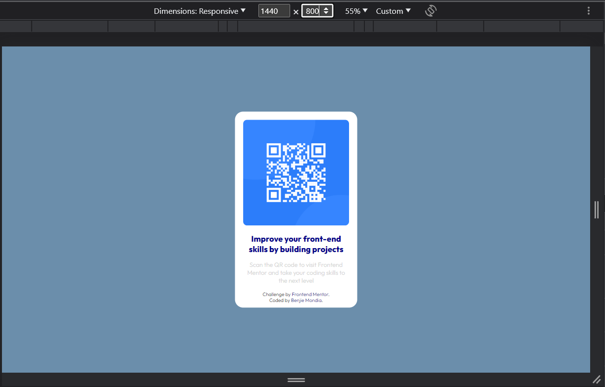

# QR Code Component Challenge

This is a solution to the QR Code Component challenge on Frontend Mentor. Frontend Mentor challenges help you improve your coding skills by building realistic projects.

## Table of Contents

- [Overview](#overview)
- [Built with](#built-with)
- [Author](#author)

## Overview




Improve your front-end skills by building projects. Scan the QR code to visit Frontend Mentor and take your coding skills to the next level.

## Built with

- HTML
- CSS

### Font

```css
@font-face {
    font-family: 'Outfit-Black';
    src: url('dist/fonts/Outfit-Black.ttf')
}

@font-face {
    font-family: 'Outfit-Light';
    src: url('dist/fonts/Outfit-Light.ttf')
}
```

### CSS Styles 

```css
* {
    margin: 0;
    padding: 0;
}

body {
    background-color: hsl(212, 45%, 89%);
}

.container {
    background-color: hsl(0, 0%, 100%);
    width: 18%;
    height: auto;
    display: flex;
    flex-direction: column;
    justify-content: center;
    align-items: center;
    position: absolute;
    top: 50%;
    left: 50%;
    transform: translate(-50%, -50%);
    padding: 20px 20px 10px 20px;
    border-radius: 20px;
}

.qrcode-image img {
    max-width: 100%;
    height: auto;
    border-radius: 10px;
    margin-bottom: 1rem;
}

.details {
    display: flex;
    flex-direction: column;
    align-items: center;
    text-align: center;
}

.details h3 {
    font-family: Outfit-Black, Arial, sans-serif;
    color: hsl(218, 44%, 22%);
    font-size: 20px;
    font-weight: 700;
    margin-bottom: 1rem;
}

.details p {
    font-family: Outfit-Light, Arial, sans-serif;
    font-size: 15px;
    font-weight: 300;
    margin-bottom: 2rem;
    color: hsl(220, 15%, 55%);
}

@media (max-width: 600px) {
    .container {
        width: 80%;
        margin: auto;
    }

    .qrcode-image img {
        margin-bottom: 0.5rem;
    }

    .details h3 {
        font-size: 24px;
    }

    .details p {
        font-size: 18px;
    }
}
```

### Author

- Author - [Benjie Mondia](https://github.com/benjamineke)
- Challenge by [Frontend Mentor](https://www.frontendmentor.io?ref=challenge)